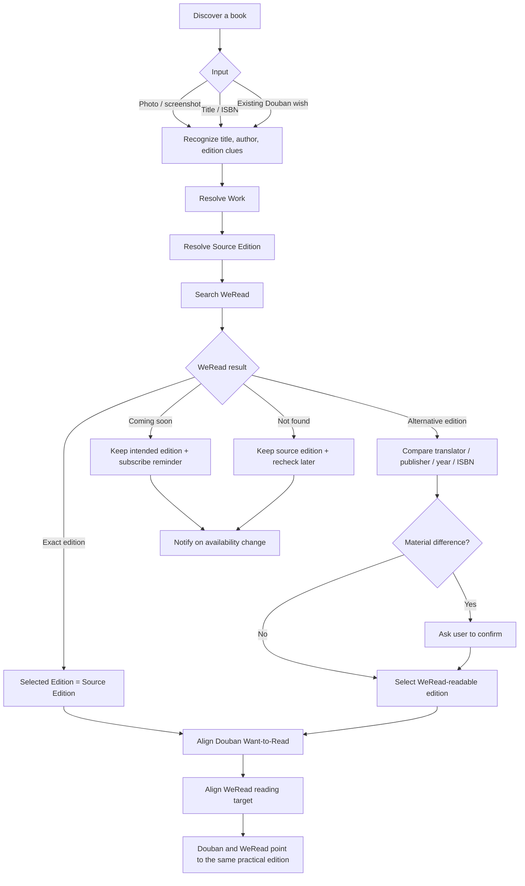

# Douban × WeRead

Keep your Douban “Want to Read” list aligned with the editions actually available on WeRead.

> 让豆瓣「想读」和微信读书真正可读的版本保持一致。

## What this project solves

A book title is not a unique identity. The same work may have multiple editions with different translators, publishers, publication dates, covers, and ISBNs.

`douban-weread` identifies the work and edition you discovered, checks what is actually available on WeRead, and then aligns your active Douban “Want to Read” edition with the practical edition you can read on WeRead.

## Quick start: CLI search

The first interface-independent demo can search public Douban Book web pages by title or ISBN without Feishu or WeRead credentials. Python 3.10+ is supported.

```bash
git clone https://github.com/LCubed101/douban-weread.git
cd douban-weread
git checkout agent/douban-wish-action
python3 -m venv .venv
source .venv/bin/activate
python3 -m pip install --upgrade pip
python3 -m pip install -e .
```

Search by title:

```bash
python3 -m douban_weread search "百年孤独"
# or, after installation:
douban-weread search "百年孤独"
```

Search an exact edition by ISBN:

```bash
python3 -m douban_weread search --isbn 9787544253994
```

A title search intentionally prints multiple candidate editions when available so the user can compare translator, publisher, publication date, and ISBN before any future state-changing action.

## Douban authentication and Want-to-Read

Authenticated actions use a user-owned browser Cookie stored only in the local environment. **Never commit the real Cookie or paste it into issues, PR comments, screenshots, or chat messages.**

The current implementation expects a complete `DOUBAN_COOKIE` containing at least `dbcl2` and `ck`.

First run the read-only auth check:

```bash
douban-weread auth check
```

The state-changing command is deliberately explicit:

```bash
douban-weread wish --subject <DOUBAN_SUBJECT_ID> --confirm
```

Without `--confirm`, the command refuses to change state. After a POST, the client reads the subject state back and reports success only if Douban actually saved `wish`.

The authenticated Book interest route is an unofficial/internal interface and still requires live user-owned Cookie validation. See [docs/DOUBAN_AUTH.md](docs/DOUBAN_AUTH.md) before testing writes.

CLI exit codes:

- `0` — success
- `1` — Douban auth/provider/network error
- `2` — invalid CLI arguments (standard `argparse` behavior)
- `3` — no matching edition found
- `4` — state-changing action missing explicit confirmation
- `5` — write response returned but saved-state verification failed

> Public book discovery uses Douban Book web search plus subject pages and does not depend on the legacy `api.douban.com/v2/book` endpoint. Authenticated interest changes use a separate unofficial/internal web adapter. Douban page structure, anti-abuse behavior, Cookie semantics, and internal endpoints may change, so all providers should fail conservatively.

For real-world failure modes and fixes, see [docs/TROUBLESHOOTING.md](docs/TROUBLESHOOTING.md). For successful end-to-end smoke-test snapshots, see [docs/LIVE_VALIDATION.md](docs/LIVE_VALIDATION.md).

## User flow



## Core concepts

### Work
The underlying intellectual work, independent of a specific publication.

### Source Edition
The edition the user originally discovered or intended to read.

### Selected Edition
The edition ultimately chosen for actual reading and platform alignment.

Default principle:

> Preserve the edition the user discovered, but align the active reading target to an edition the user can actually read on WeRead.

## Edition matching priority

1. Exact ISBN match
2. Same title + author + translator
3. Same title + author + publisher
4. Same title + author + publication year
5. Same work, different edition available on WeRead

If the exact source edition is unavailable on WeRead but another edition of the same work is available, that readable edition may become the Selected Edition. Douban should then be aligned to the same edition, with user confirmation when translator or content differences are material.

## WeRead states

- `AVAILABLE_EXACT`
- `AVAILABLE_ALTERNATIVE`
- `COMING_SOON`
- `NOT_FOUND`

## Interfaces

Feishu is planned as the first chat interface, but it is not a required dependency of the core project. Future interfaces can include Web UI, CLI, Telegram, or macOS Shortcuts.

The project ends at Douban/WeRead alignment. Users can read on any device that supports WeRead.

## Architecture

```text
douban-weread/
├── capture/
├── resolver/
├── providers/
│   ├── douban/
│   └── weread/
├── apps/
│   └── feishu/
├── notifications/
├── storage/
├── docs/
└── tests/
```

## Roadmap

See [ROADMAP.md](ROADMAP.md).

## Acknowledgements

See [ACKNOWLEDGEMENTS.md](ACKNOWLEDGEMENTS.md). We will clearly distinguish inspiration, implementation references, and any direct code reuse, and preserve upstream license requirements when applicable.

## Privacy

This project is intended to be self-hosted. User credentials, cookies, and API keys should remain in environment variables and must never be committed.

## Status

Early architecture / alpha planning stage.

## License

MIT
