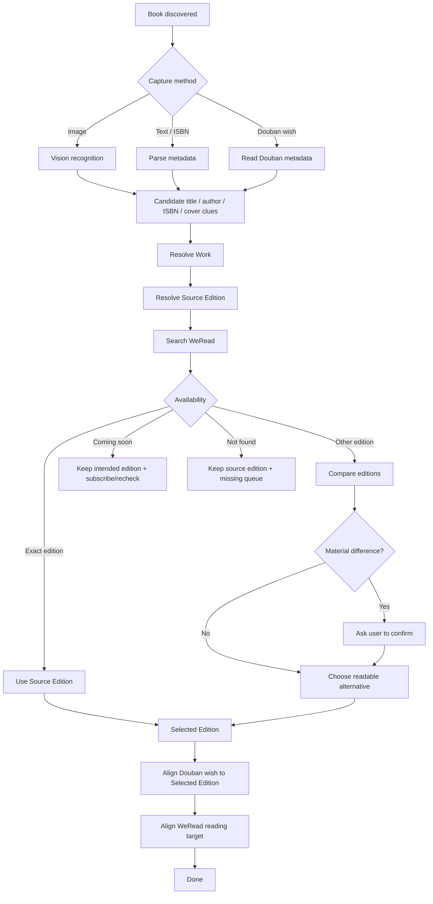

# User Flow

## Product goal

Reduce the friction between **discovering a book** and **actually reading an available edition on WeRead**, while keeping the user's Douban “Want to Read” state aligned with that practical edition.

## Entry points

A user may start from:

1. A photo or screenshot of a book
2. A typed title / author / ISBN
3. A Douban book link
4. An existing Douban `wish` entry

Feishu is the first planned chat interface, but the core workflow must remain interface-independent.

## Flow

## Important distinction: Source vs Selected Edition

### Source Edition
The edition that caused the user's interest. It may come from a photo, a recommendation, or an existing Douban mark.

### Selected Edition
The edition the user will actually read. It should be the best available edition on WeRead that still represents the same intended work.

The Source Edition should never be discarded. It remains part of the provenance/history even when the Selected Edition changes.

## Edition decision rules

### Case A — Exact edition exists on WeRead

- Keep the same edition
- Mark that edition as Douban `wish`
- Add/open that edition in WeRead

### Case B — Exact edition does not exist, but another edition of the same work exists

- Compare translator
- Compare publisher
- Compare publication year
- Compare ISBN
- Compare language / abridgement / revised-edition signals

If the difference is minor, recommend switching to the readable WeRead edition.

If the difference may materially affect the reading experience (for example a different translator), ask the user to confirm.

After confirmation:

- Selected Edition = WeRead-readable edition
- Douban `wish` should be moved/aligned to that same edition

### Case C — WeRead entry is coming soon

- Keep the intended edition on Douban
- Subscribe to the WeRead availability reminder where technically possible
- Otherwise keep a recheck record
- Notify only when state changes

### Case D — No suitable WeRead entry exists

- Keep the Source Edition on Douban
- Add the work to a missing/recheck queue
- Periodically retry

## Notification principles

Do not push repetitive messages. Notify only for meaningful transitions such as:

- `NOT_FOUND -> COMING_SOON`
- `NOT_FOUND -> AVAILABLE_ALTERNATIVE`
- `COMING_SOON -> AVAILABLE_EXACT`
- a previously ambiguous edition now has a confident match

## Non-goals

The project does not depend on a specific reading device. BOOX, iPhone, iPad, Android tablets and other WeRead-capable devices are downstream of this project and outside the core scope.
